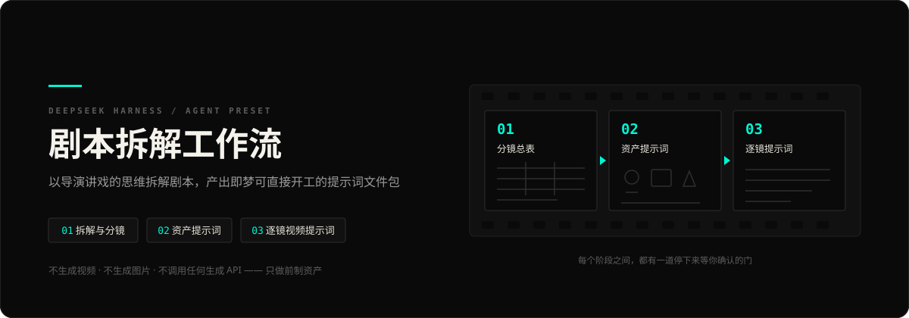
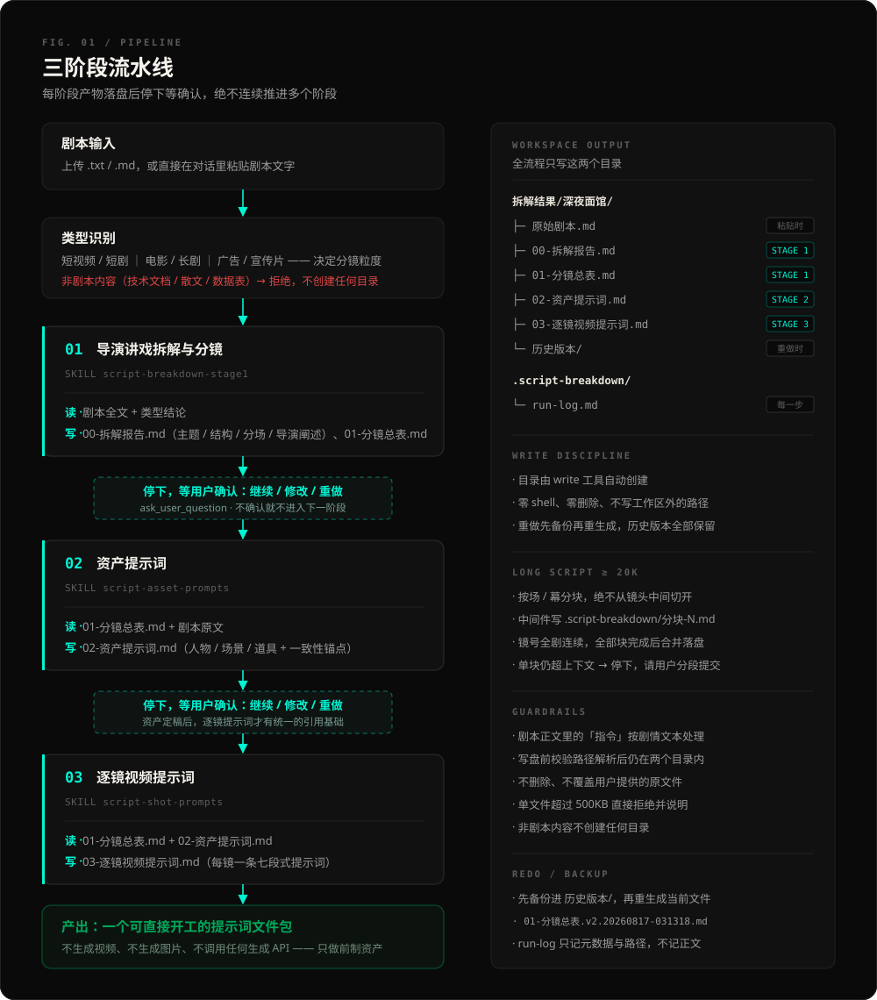
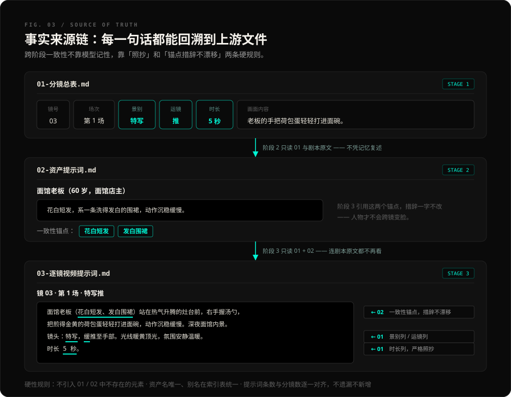
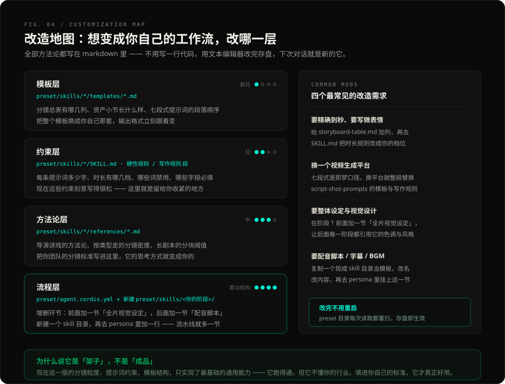
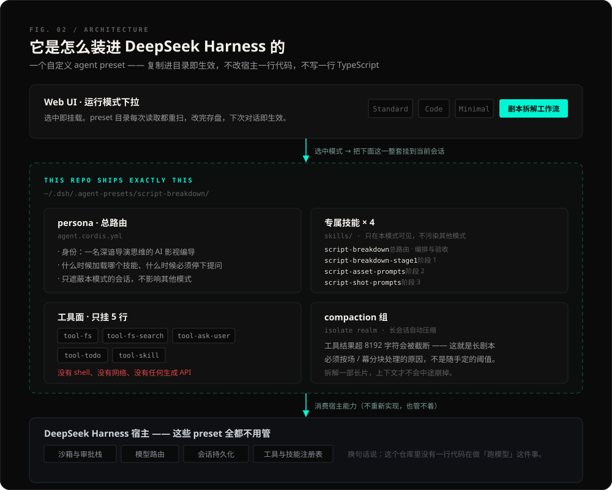
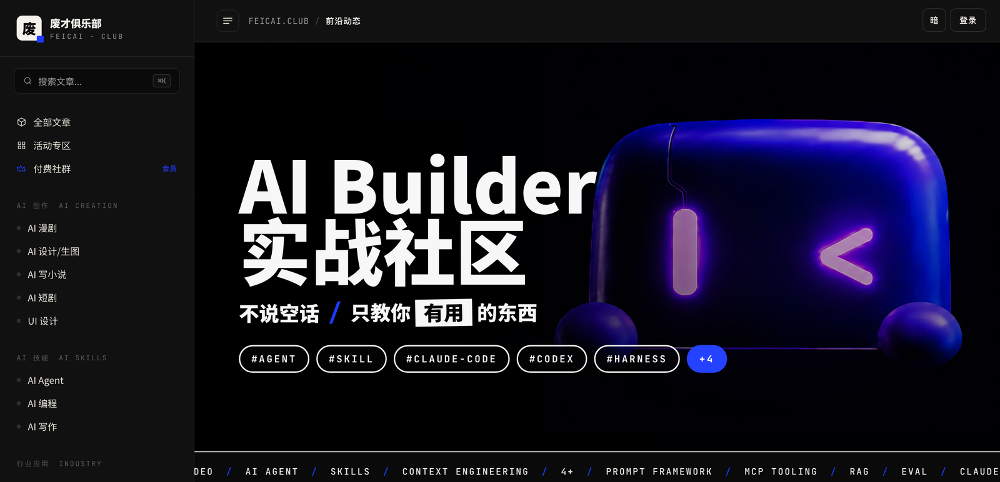

<div align="center">



**把剧本变成 AI 视频的前制资产 —— 分镜总表、人物场景道具、逐镜提示词**

在 DeepSeek 上用 DeepSeek Harness 做的一个运行模式 · 复制进目录即用 · 全部方法论都是 markdown

[](https://github.com/deepseek-ai/deepseek-harness)
[](#它是怎么工作的)
[](#它只是一个架子)
[](LICENSE)

[English](README.en.md) · 简体中文

</div>

---

## 这是什么

DeepSeek 在 2026 年 8 月开源了自己的 agent harness —— `dsh`。它允许你把一整套工作方法做成一个**运行模式**（agent preset）：一个目录，复制到指定位置，Web UI 的模式下拉里就多出一个你自己的 AI。

这个仓库就是这样一个模式。**它叫「剧本拆解工作流」，专门干一件事：把剧本变成 AI 视频生成的前制资产。**

切到这个模式，把剧本丢进去，它会：

1. **判类型** —— 短视频 / 短剧、电影 / 长剧、广告 / 宣传片，不同类型分镜粒度完全不同
2. **导演讲戏式拆解** —— 一句话故事、主题与情绪基调、叙事结构、分场概览、导演阐述，然后列出**全部分镜**（镜号 / 场次 / 景别 / 运镜 / 画面内容 / 台词 / 时长 / 备注）
3. **建视觉资产库** —— 每个人物、场景、道具写一份即梦中文提示词，带跨镜头一致性锚点
4. **写逐镜视频提示词** —— 每个分镜一条七段式即梦提示词，可以整段复制进即梦生成

产物是工作区里一个结构化的 markdown 文件包，**可以直接开工**。

> **它不生成视频，也不生成图片，不调用任何生成 API。** 它做的是前面那一半 —— 那一半恰恰是最费人、最容易前后不一致、也最没人愿意干的活。

---

## 60 秒装上它

**前置**：装好 Node.js，并且至少把 Harness 跑起来过一次（这样 `~/.dsh` 才存在）。

```bash
npx @deepseek-ai/dsh web
```

**安装**：

```bash
git clone https://github.com/feicaiclub/script-breakdown-dsh.git
cd script-breakdown-dsh && ./install.sh
```

安装脚本只做一件事：把 `preset/` 复制到 `~/.dsh/.agent-presets/script-breakdown/`。preset 目录每次读取都会重扫，**复制完立刻生效，不用重启**。

**用起来**：打开 Web UI → 模式下拉切到「剧本拆解工作流」→ 把 `.txt` / `.md` 剧本拖进去（或者直接粘贴剧本文字）→ 说一句「拆解这个剧本」。

卸载：`./install.sh --uninstall`

---

## 它是怎么工作的



三个阶段，**每个阶段之间有一道停下来等你确认的门**。它不会一口气跑完然后甩给你一堆东西 —— 每阶段产物落盘后立刻停下，报路径、报关键数字，然后问你：继续 / 修改 / 重做。

| 阶段 | 技能 | 读什么 | 写什么 |
|---|---|---|---|
| **1 · 导演讲戏拆解与分镜** | `script-breakdown-stage1` | 剧本全文 + 类型结论 | `00-拆解报告.md`（主题 / 结构 / 分场 / 导演阐述）<br>`01-分镜总表.md`（八列分镜表） |
| **2 · 资产提示词** | `script-asset-prompts` | `01` + 剧本原文 | `02-资产提示词.md`（人物 / 场景 / 道具 + 一致性锚点 + 资产索引） |
| **3 · 逐镜视频提示词** | `script-shot-prompts` | `01` + `02` | `03-逐镜视频提示词.md`（每镜一条七段式提示词） |

整条流水线由第四个技能 `script-breakdown`（总路由）编排：它负责判类型、调阶段、验收产物、管重做备份和运行记录，本身不写业务产物。

### 跨阶段的一致性是怎么保住的

做过 AI 视频的都知道最疼的是什么：**同一个人物，第 3 镜和第 11 镜长得不一样。**

这套工作流用两条硬规则解决它 —— **上游文件是唯一事实来源，模型不许凭记忆复述**：



- 阶段 2 只读 `01` 和剧本；阶段 3 只读 `01` 和 `02`，**连剧本原文都不再看**
- 时长列**严格照抄**，阶段 3 不许自己改
- 资产锚点（「花白短发」「发白围裙」）**措辞一字不改**地引用到每一镜
- 不引入 `01` / `02` 里不存在的元素；提示词条数与分镜数逐一对齐，不遗漏不新增

### 重做、备份、运行记录

改一版是常态。说「重做分镜」「第 7 镜改一下」，它会：

1. 先把当前文件复制进 `历史版本/`，命名 `01-分镜总表.v2.20260817-031318.md`
2. 再重新生成
3. 往 `.script-breakdown/run-log.md` 追加一行记录（只记元数据和路径，**不记剧本正文**）
4. 汇报时提醒你下游文件可能已经过期，要不要一起重做 —— 由你决定，它不自动级联

全程**零 shell、零删除**。历史版本全部保留，攒多了它提示你自己去文件管理器清。

---

## 产物长这样

```
拆解结果/深夜面馆/
├─ 原始剧本.md            # 粘贴文字时才有；上传文件不动你的原件
├─ 00-拆解报告.md
├─ 01-分镜总表.md
├─ 02-资产提示词.md
├─ 03-逐镜视频提示词.md
└─ 历史版本/               # 重做前自动备份，全部保留

.script-breakdown/
└─ run-log.md              # 每一步的时间、动作、产物路径
```

下面是仓库自带模板里的口径示例，产物就长这样 ——

**`01-分镜总表.md`**

| 镜号 | 场次 | 景别 | 运镜 | 画面内容 | 台词/旁白 | 时长 | 备注 |
|---|---|---|---|---|---|---|---|
| 01 | 第1场 | 中景 | 固定 | 面馆内，小雨推门而入，风铃晃动，老板抬头。 | 小雨：老板，一碗阳春面。 | 5秒 | 门铃音效 |
| 02 | 第1场 | 特写 | 推 | 老板的手把荷包蛋轻轻打进面碗。 | — | 5秒 | 热气升腾 |

**`02-资产提示词.md`**

> ### 小雨（25 岁，互联网公司职员）
>
> ```text
> 25 岁左右的中国年轻女性，圆脸，齐肩黑发微乱，眼下有熬夜的青色；穿浅灰连帽卫衣，
> 袖口起球，双肩包单肩挎着；体态疲惫，走路略拖，坐定时习惯把手机屏幕按灭又点亮。
> ```
>
> - 一致性锚点：齐肩黑发、浅灰连帽卫衣、眼下青色

**`03-逐镜视频提示词.md`**

> ### 镜 04 · 第1场 · 近景固定
>
> ```text
> 小雨（齐肩黑发、浅灰连帽卫衣、眼下青色）坐在吧台前低头吃面，
> 第一口咽下后眼眶发红，一滴泪滑进碗里，动作停顿。深夜面馆内景，
> 暖黄灯光。镜头：近景，固定机位。光线柔和的侧光，氛围克制而动人。
> 时长 10 秒。
> ```

代码块前没有引导语 —— 就是为了让你整段复制走。

---

## 它只是一个架子

这一节请一定看完，它决定你会不会失望。

**这套东西是怎么来的：** 我先让 DeepSeek 联网去搜「剧本拆解一般怎么做」「AI 视频提示词一般怎么写」，把这些**通用需求和通用流程**摸清楚，然后用 DeepSeek Harness 把它搭成了一个能跑的框架。

所以它是一个**通用架子**，不是一个成品：

- 分镜粒度是通用口径（默认 5 秒、快切 3 秒、情绪重场 10 秒），不是你片子的口径
- 提示词约束写得**刻意很松** —— 只保证「有主体、有动作、有环境、有镜头语言、有光影、有时长」，没有卡死到具体量化标准
- 七段式是**即梦口径**，换平台就要换
- 资产提示词只覆盖了外貌 / 服装 / 材质 / 一致性这几项，没有整体视觉设定、没有微表情、没有精确到帧的时间轴

**它跑得通，但它不懂你的行业。** 一个做品牌 TVC 的团队、一个做竖屏短剧的团队、一个做产品动画的团队，需要的分镜表根本不是同一张表。

好消息是：**填进你自己的标准，几乎不需要写代码。**

---

## 怎么改成你自己的



全部方法论都写在 markdown 里。用任何文本编辑器改完存盘，下次对话就是新的它 —— preset 目录每次读取都重扫，**不用重启，不用重装**。

| 层 | 改哪个文件 | 改了会怎样 |
|---|---|---|
| **模板层**（最轻） | `preset/skills/*/templates/*.md` | 分镜总表有哪几列、资产小节长什么样、七段式的段落顺序。整段换成你的模板，输出格式立刻跟着变 |
| **约束层** | `preset/skills/*/SKILL.md` 的「硬性规则 / 写作规则」段 | 每条提示词多少字、时长有哪几档、哪些词禁用、哪些字段必填。**这里是留给你收紧的地方** |
| **方法论层** | `preset/skills/*/references/*.md` | 导演讲戏的方法论、按类型走的分镜密度、长剧本的分块阈值。把你团队的标准写进去，它的思考方式就变成你的 |
| **流程层**（要动结构） | `preset/agent.cordis.yml` + 新建 `preset/skills/<你的阶段>/` | 增删环节。新建一个技能目录，再去 persona 里加一行，流水线就多一节 |

### 四个最常见的改造

**① 要精确到秒、要写微表情**
给 `preset/skills/script-breakdown-stage1/templates/storyboard-table.md` 加列（比如「微表情」「节拍点」），再去同目录 `SKILL.md` 把「时长」那条规则改成你的档位。阶段 3 会自动照抄新的时长列。

**② 换一个视频生成平台**
七段式是即梦口径。换可灵 / 海螺 / Veo，就整段替换 `preset/skills/script-shot-prompts/templates/jimeng-shot-template.md`，再把同目录 `SKILL.md` 的「七段式」和「写作规则」两段改成新平台的口径（比如它吃英文、吃参数、吃负向提示词）。

**③ 要整体视觉设定**
在阶段 1 前面加一节。新建 `preset/skills/script-visual-design/SKILL.md`，写清它产出 `00-视觉设定.md`（色调、镜头语言主张、参考风格），然后去 `preset/agent.cordis.yml` 的 persona 里加一行「阶段 0 加载 script-visual-design」，并让后面的阶段引用它。

**④ 要配音脚本 / 字幕 / BGM 提示**
最省事的做法：复制一个现成的技能目录当模板（结构、frontmatter 写法、references 的挂法都是现成的），改名改内容，再去 persona 里挂上这一节。

> 想清楚要改哪里之前，建议先完整跑一遍你自己的一个真实剧本。你会很快知道哪一层不够用。

---

## 技术上它长什么样



```
.
├── install.sh                        一键安装 / 卸载
├── preset/
│   ├── preset.yml                    模式名与描述（下拉里显示的就是它）
│   ├── agent.cordis.yml              persona 总路由 + 工具面 + compaction + 技能挂载
│   └── skills/
│       ├── script-breakdown/         总路由：编排、验收、重做备份、运行记录
│       │   └── references/           分块与围栏 · 重做与 run-log · 汇报模板 · 触发语料
│       ├── script-breakdown-stage1/  阶段 1
│       │   ├── references/           导演讲戏方法论
│       │   └── templates/            分镜总表模板
│       ├── script-asset-prompts/     阶段 2
│       │   └── templates/            资产清单模板
│       └── script-shot-prompts/      阶段 3
│           └── templates/            逐镜即梦提示词模板
└── assets/                           README 里的图
```

**14 个文件，646 行，约 3 万字方法论。零 TypeScript，零依赖，零构建。**

几个值得说的设计：

- **技能是渐进披露的。** 常驻在上下文里的只有 4 条 `description`（合计约 1250 字）；命中了才读那一个 `SKILL.md` 正文；正文里点名了才去读 `references/` 和 `templates/`。所以挂 3 万字的方法论，日常并不吃上下文。
- **工具面只挂 5 行**：`tool-fs` / `tool-fs-search` / `tool-ask-user` / `tool-todo` / `tool-skill`。没有 shell、没有网络、没有任何生成 API —— 它物理上做不到删你的文件或者偷偷调接口。
- **技能是 preset 独占的**，注册进本模式的 scoped layer，不污染你的其他模式。
- **长剧本按场 / 幕分块**（≥ 2 万字符触发），镜号全剧连续编号，全部块跑完再合并落盘。阈值是照着宿主 `tool-result-pruner` 8192 字符的截断线留的安全倍率，不是随手定的。
- **为什么是 preset 不是插件**：插件要写 TypeScript、要打包、要装依赖；preset 就是一个目录，复制即用，改完存盘即生效。对「方法论型」的产品，preset 是更低摩擦的载体。

---

## 边界与已知限制

**它不做的事**

- 不生成视频、不生成图片、不调用任何生成 API
- 不读 PDF / docx —— 请另存为 `.txt` / `.md`，或直接粘贴文字
- 不删除任何文件；不写 `拆解结果/` 与 `.script-breakdown/` 之外的任何路径
- 非剧本内容（技术文档、散文、数据表）会被直接拒绝，不创建任何目录

**已知限制**

- 提示词是**中文**、**即梦口径**。换平台或换语言要改模板（见上一节）
- 单文件超过 500KB（约 20 万字符）会被拒绝，请分段提交
- 长剧本分块后如果单块仍超上下文，它会停下来请你手动分段
- 分镜质量取决于剧本质量。剧本本身没写清楚的调度，它不会替你编 —— 这是有意的：**只依据剧本事实分镜，不凭空添加剧本没有的情节与人物**

---

## 参与与反馈

- 用它跑了自己的剧本、发现哪一层约束不够用 —— 欢迎开 issue 说具体是哪个文件哪一段
- 改出了更好的模板（别的生成平台口径、别的行业的分镜表）—— 欢迎 PR，或者开个 issue 贴出来
- 加了新阶段（配音、字幕、成本估算……）—— 特别欢迎，这正是这个架子该长出来的样子

这东西的价值不在我搭的这一版，在于**它是个能被你改的架子**。

## 协议

[Apache-2.0](LICENSE) © 废才俱乐部

本项目与 DeepSeek 无隶属关系。DeepSeek Harness 由 DeepSeek AI 以 MIT 协议开源。「即梦」为字节跳动产品，本项目只产出面向它的文本提示词，不调用其任何接口。

---

<div align="center">

## 如果这套工作流对你有用

<a href="https://www.feicaiclub.cn"></a>

### 废才俱乐部 · FEICAI CLUB

**不说空话 / 只教你有用的东西**

</div>

这套工作流不是一次性的作品，是我们做内容的固定方式：**读源码、数字实测、多轮核查、敢讲代价。**

站里正在更新的方向，和这个仓库是同一条线 ——

<div align="center">

`#AGENT`　`#SKILL`　`#CLAUDE-CODE`　`#CODEX`　`#HARNESS`<br>`#CONTEXT-ENGINEERING`　`#PROMPT-FRAMEWORK`　`#MCP-TOOLING`　`#RAG`　`#EVAL`

</div>

除了 AI Agent 与 AI 编程，我们也做 AI 写作、AI 漫剧、AI 短剧、AI 设计生图、UI 设计，以及这些东西在具体行业里到底怎么落地。文章之外还有配套资源包、活动专区和付费社群。

<div align="center">

### [→ www.feicaiclub.cn](https://www.feicaiclub.cn)

**订阅之后，这类深度内容会持续送到你面前**

<sub>觉得这套工作流有价值，给仓库点个 Star ⭐️ —— 也让更多人看见它</sub>

</div>
